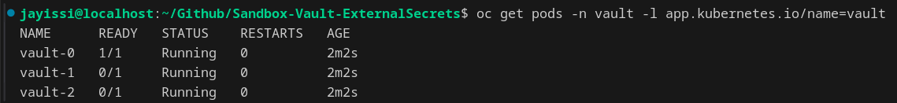
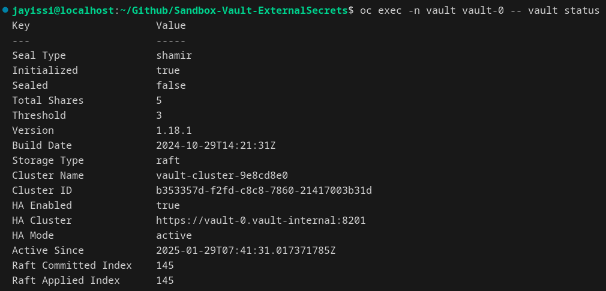
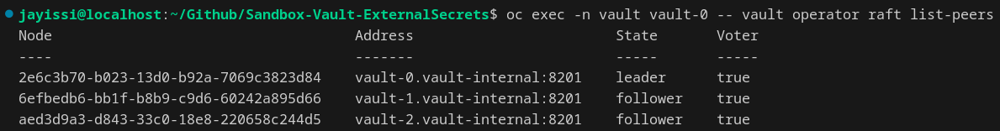
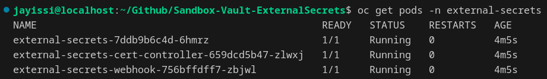
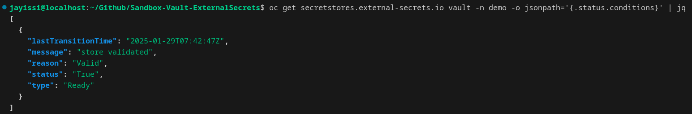
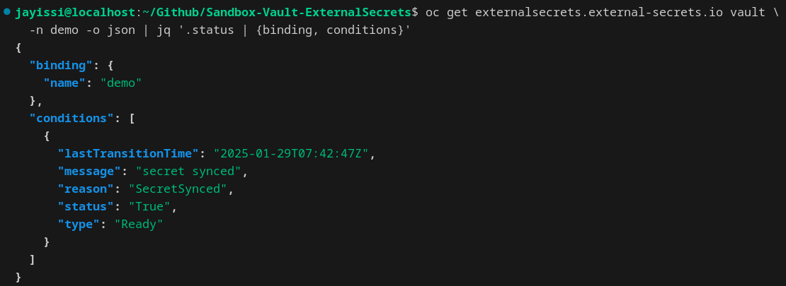
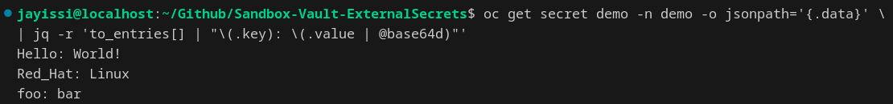

# Sandbox Vault ExternalSecrets


---

Welcome to the **Sandbox Vault External Secrets** project! This project serves as a robust sandbox environment for an automated deployment and integration of [HashiCorp Vault](https://github.com/hashicorp/vault-helm) and [External Secrets Operator](https://github.com/external-secrets/external-secrets). Whether you're new to HashiCorp Vault or an experienced user, this project serves as a hands-on, experimental platform to explore and integrate secure secrets management with OpenShift.

---

## Table of Contents
1. [Summary](#summary)
2. [Requirements](#requirements)
3. [Installation and Setup](#installation-and-setup)
   - [Prerequisites](#prerequisites)
   - [Clone the Repository](#clone-the-repository)
   - [Define the environment](#define-the-environment)
   - [Execute Makefile](#execute-makefile)
   - [Trust But Verify](#trust-but-verify)
4. [Under The Hood](#under-the-hood)
   - [Vault Deployment](#vault-deployment)
   - [Vault Unsealing](#vault-unsealing)
   - [External Secrets Operator](#external-secrets-operator)
   - [Demo secret Creation in Vault](#demo-secret-creation-in-vault)
   - [Syncing Vault Secrets to OpenShift](#syncing-vault-secrets-to-openshift)
5. [How It All Comes Together](#how-it-all-comes-together)
6. [Uninstall](#uninstall)
7. [License](#license)

---

## Summary

This repository streamlines the deployment and configuration of HashiCorp Vault and External Secrets Operator (ESO) within OpenShift clusters. By automating these processes, users can securely manage secrets and synchronize them seamlessly with OpenShift. Key features include:

- Deploying HashiCorp Vault via Helm.  
- Initializing and unsealing HashiCorp Vault automatically based on specific environments (`lab` or `prod`).  
- Installing External Secrets Operator to enable secret synchronization from HashiCorp Vault to OpenShift.  
- Demonstrating real-world scenarios with a pre-configured demo secret.

---

## Requirements

Before proceeding, ensure the following prerequisites are met:

- **OpenShift Cluster**: A functional OpenShift cluster.  
- **Helm**: Version 3.6 or later. [Install Helm](https://helm.sh/docs/intro/install/).  
- **OpenShift CLI (oc)**: Required for cluster interactions. [Install OpenShift CLI](https://docs.openshift.com/container-platform/latest/cli_reference/openshift_cli/getting-started-cli.html).  
- **Make**: Required to run `Makefile` tasks. [Install Make](https://www.gnu.org/software/make/).  
- **jq**: A command-line JSON processor. [Install jq](https://stedolan.github.io/jq/download/).  
- **Git**: Required for repository cloning. [Install Git](https://git-scm.com/book/en/v2/Getting-Started-Installing-Git).  
- **Access to Helm Repositories**: Ensure network access to [HashiCorp](https://helm.releases.hashicorp.com) and [External-Secrets](https://charts.external-secrets.io) repositories.  

---

## Installation and Setup

For advanced configurations, refer to:  
- [HashiCorp Vault Documentation](https://developer.hashicorp.com/vault/docs)  
- [External Secrets Operator Documentation](https://external-secrets.io/) 

<br>

> [!IMPORTANT]
> Ensure elevated permissions in your OpenShift cluster **before** proceeding.

---

### Prerequisites

1. **Install Helm**

   ```bash
   mkdir $HOME/bin/
   curl -fqsLk https://get.helm.sh/helm-v3.17.0-linux-amd64.tar.gz | tar xvz -C $HOME/bin/
   mv $HOME/bin/linux-amd64/helm $HOME/bin/ && rm -r $HOME/bin/linux-amd64
   ```
<br>

> [!WARNING]
> This example uses ***Linux x86_64*** processor architecture.     
> Modify the architecture for your system as needed. [Find the appropriate version here](https://github.com/helm/helm/releases/latest).

<br>

2. **Install Required Packages**

   ```bash
   sudo dnf install -y make jq git
   ```
---

### Clone the Repository

   Clone the repository and navigate into the project directory.

   ```bash
   git clone https://github.com/jayissi/Sandbox-Vault-ExternalSecrets.git
   cd Sandbox-Vault-ExternalSecrets
   ```
---

### Define the environment

Set the `VAULT_ENV` variable based on your target environment:

|  `VAULT_ENV`  | Description |
|-------------|-------------|
|  `dev`  | Deploy a single Vault instance in "Dev" server mode. |
|  `lab`  | Deploy a single instance with auto initialization, unsealing, and auditing. |
|  `prod` | Deploy 3 High Availability (HA) instances with auto initialization, unsealing, and auditing. |

<br>
   Example:
   
   ```bash
   export VAULT_ENV=dev  # Options: dev, lab, prod
   ```
<br>

  > [!NOTE]
  > This will configure HashiCorp Vault into ["Dev" server mode](https://developer.hashicorp.com/vault/docs/concepts/dev-server).     
  > HashiCorp Vault will be automatically initialized and unsealed.

---

### Execute Makefile

   Execute the `Makefile` to deploy the environment:
   
   ```bash
   make $VAULT_ENV
   ```

---

## Trust But Verify


### Verify HashiCorp Vault

  Confirm vault pods are running

  ```bash
  oc get pods -n vault -l app.kubernetes.io/name=vault
  ```

<p align="center">
    
</p>

  Verify vault status

  ```bash
  for pod in $(oc get pods -n vault -l app.kubernetes.io/name=vault -o jsonpath='{.items[*].metadata.name}'); do
    echo "Status for $pod:"
    oc exec -n vault $pod -- vault status
    echo "---------------------------"
  done
  ```

<p align="center">
    
</p>

  List the raft peers in vault cluster

  ```bash
  oc exec -n vault vault-0 -- vault operator raft list-peers
  ```

<p align="center">
    
</p>

### Verify External Secrets Operator

  Confirm external-secrets pods are running

  ```bash
  oc get pods -n external-secrets
  ```

<p align="center">
    
</p>

  Validate secret store status is true

  ```bash
  oc get secretstores.external-secrets.io vault -n demo -o jsonpath='{.status.conditions}' | jq
  ```

<p align="center">
    
</p>

 Verify external secrets secret is synced 

  ```bash
  oc get externalsecrets.external-secrets.io vault -n demo -o json | jq '.status | {binding, conditions}'
  ```

<p align="center">
    
</p>


### Validate demo secret content in OpenShift

  Display the decoded contents of `secret/demo`

  ```bash 
  oc get secret demo -n demo -o jsonpath='{.data}' | jq -r 'to_entries[] | "\(.key): \(.value | @base64d)"'
  ```

<p align="center">
    
</p>


---

## Under The Hood

This repository automates the deployment and configuration of **HashiCorp Vault** and **External Secrets Operator** on OpenShift. It includes a `Makefile` that orchestrates the entire process from deploying HashiCorp Vault to introducing secrets to OpenShift. The following key tasks are performed:

<br>

### **Vault Deployment**:
- **What it is**: HashiCorp Vault is a tool for managing secrets, sensitive data, and encryption. In this project, HashiCorp Vault is deployed using its official Helm chart.
- **How it works**: The `Makefile` automates the deployment of HashiCorp Vault using Helm. HashiCorp Vault is deployed into the OpenShift cluster, and the necessary configurations are applied for the dev, lab, and production environments.
- **Why it’s needed**: HashiCorp Vault will securely store secrets that are later accessed by OpenShift through External Secrets Operator. It provides a central repository for managing secrets and sensitive configurations.

<br>

### **Vault Unsealing**:
- **What it is**: HashiCorp Vault requires a process known as "unsealing" to decrypt and initialize the HashiCorp Vault storage after deployment.
- **How it works**: The `Makefile` supports unsealing HashiCorp Vault for both `lab` and `prod` environments. Depending on the specified environment, HashiCorp Vault will be unsealed automatically after deployment. This process is automated to ensure that secrets are available for use by External Secrets Operator.
- **Why it’s needed**: HashiCorp Vault must be unsealed to allow applications to interact with it and retrieve stored secrets. This step ensures that the HashiCorp Vault instance is secure and operational.

<br>

### **External Secrets Operator**:
- **What it is**: External Secrets Operator is a tool that synchronizes secrets between external secret stores (like HashiCorp Vault) and Kubernetes/OpenShift.
- **How it works**: The `Makefile` installs External Secrets Operator via its Helm chart. Once deployed, this operator ensures that secrets from HashiCorp Vault are automatically created as Kubernetes Secrets in OpenShift. It monitors HashiCorp Vault for changes and ensures that secrets are kept up to date in the OpenShift cluster.
- **Why it’s needed**: This operator makes it easy to use HashiCorp Vault-managed secrets in OpenShift. It abstracts the complexity of manually managing secrets and makes it easy to access and rotate secrets in a secure and automated way.

<br>

### **Demo secret Creation in Vault**:
- **What it is**: The repository contains a script to populate HashiCorp Vault with demo secrets for testing purposes.
- **How it works**: After HashiCorp Vault is deployed and unsealed, the `Makefile` runs a process to inject demo secret (such as credentials, tokens, and configuration details) into HashiCorp Vault. These secrets are then used to simulate a real-world secret management scenario.
- **Why it’s needed**: The demo secret provides a simple example of how HashiCorp Vault can be used to manage and securely store application secrets. This makes it easier to test the entire flow from HashiCorp Vault to OpenShift using External Secrets Operator.

<br>

### **Syncing Vault Secrets to OpenShift**:
- **What it is**: External Secrets Operator synchronizes the secrets stored in HashiCorp Vault to OpenShift as Kubernetes Secrets, making them accessible to applications.
- **How it works**: Once the demo secret is created in HashiCorp Vault, External Secrets Operator listens for changes to HashiCorp Vault secrets and ensures they are mirrored in OpenShift. The operator ensures that any updates to the HashiCorp Vault secrets are automatically reflected in the OpenShift environment.
- **Why it’s needed**: This step ensures that OpenShift can securely and seamlessly access HashiCorp Vault-managed secrets. By automating this process, developers can focus on building applications without worrying about managing secrets.

---

## How It All Comes Together

1. **Deploy Vault**: via Helm chart, HashiCorp Vault is deployed to your OpenShift cluster.
2. **Unseal Vault**: After deployment, HashiCorp Vault is unsealed automatically.
3. **Install External Secrets Operator**: External Secrets Operator is installed via Helm to manage the synchronization of secrets from HashiCorp Vault to OpenShift.
4. **Generate Vault demo secrets**: HashiCorp Vault is populated with demo secrets that represent real-world credentials and data.
5. **Secret synchronization to OpenShift**: External Secrets Operator automatically syncs HashiCorp Vault secrets as Kubernetes Secrets in OpenShift, making them available for use by OpenShift.

---

## Uninstall

To clean up resources, run:
```bash
make clean
```

---

## License

This project is licensed under the **GNU General Public License v3.0** - see the [LICENSE](LICENSE) file for details.

The GNU General Public License v3.0 is a free, copyleft license for software and other kinds of works. It ensures that you have the freedom to share and change all versions of the program, making sure it remains free software for all its users. For more information, please refer to the [GNU General Public License v3.0](https://www.gnu.org/licenses/gpl-3.0.en.html).
